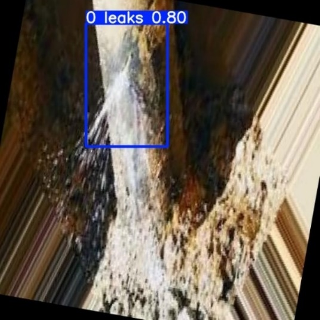
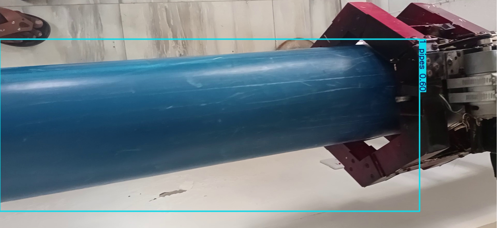
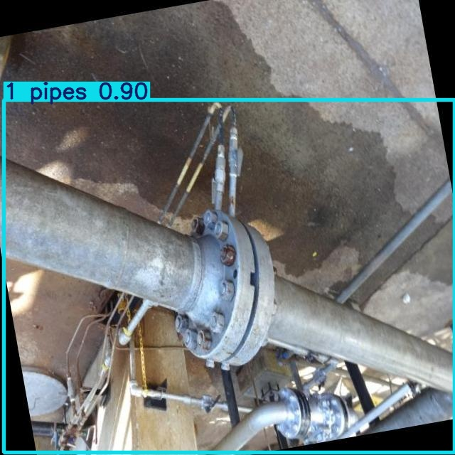
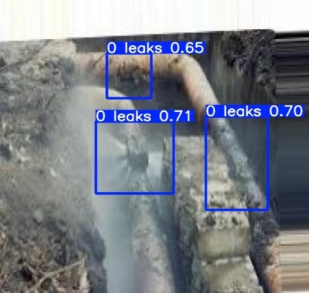
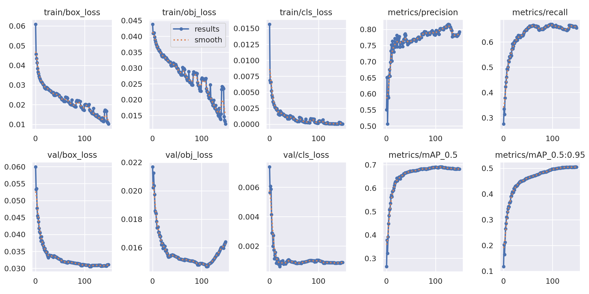
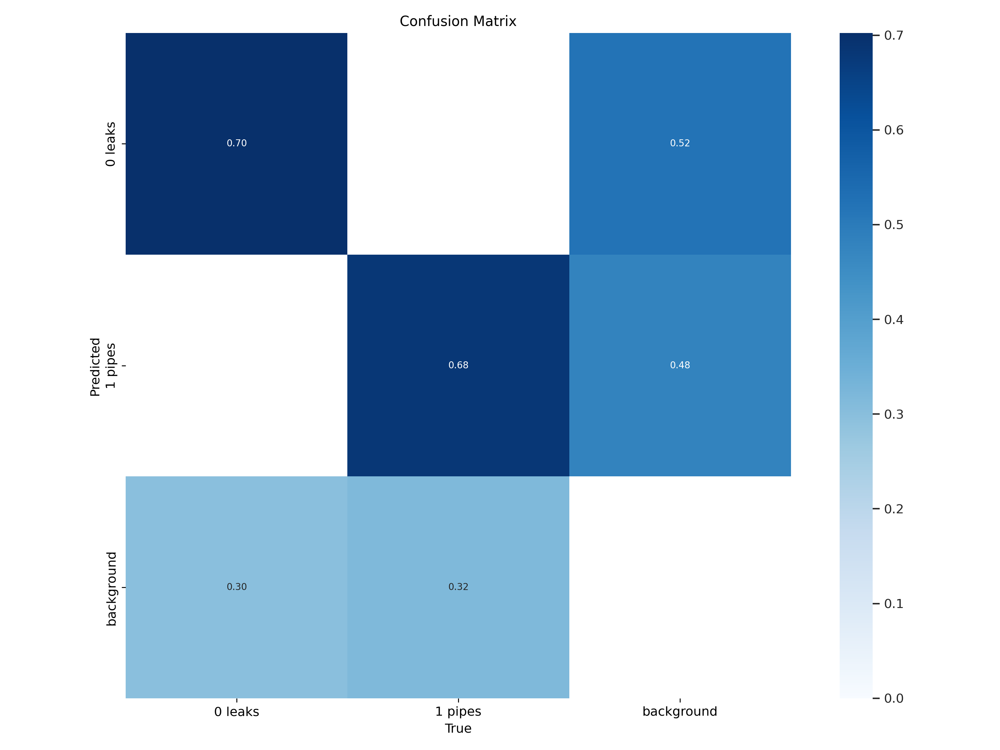

# Development of an Object Detection Algorithm for Crude Oil Pipeline Leakage Detection 
This repository contains the implementation of the research project titled _"Development of an Object Detection Algorithm for Crude Oil Pipeline Leakage Detection"_, at the Advanced Engineering and Innovation Research Group (AEIRG), Department of Mechatronics Engineering, Federal University of Technology Minna (FUTMinna), Nigeria.

---

## 🧠 Project Overview
Pipeline systems are vital for transporting oil and gas but remain vulnerable to leaks and failures that threaten the environment. 
Traditional monitoring techniques often lack real-time detection and predictive capabilities, leading to delayed responses and expensive damage. 
To address these challenges, this project leveraged computer vision and deep learning to enhance pipeline surveillance. 
The focus was on developing an intelligent object detection model capable of extracting landmark features from images and videos for real-time pipeline monitoring.

---

## 🔍 Research Objectives
- To curate a high-quality dataset suitable for training the intelligent object detection model.
- To develop an object detection model suitable for crude oil pipeline detection.
- To evaluate and assess the performance of the developed model in accurately detecting pipeline leaks under real-world conditions.

---

## ⚙️ Tools and Technologies Used

| Tool/Libraries | Purpose in the Project |
|--------------------|-----------------------|
| Python | Used as the main programming language for developing and training the computer vision model, and the algorithm. |
| OpenCV | Used for handling images, image processing, and video frame extraction. |
| YOLOv5 | Implemented for the real-time pipeline leakage detection and classification. |
| Ultralytics | Provided the implementation of YOLO used for both training and inferencing with the YOLO-based model for the pipeline leakage detection and classification. |
| Pytorch | Used for model training and performance evaluation. |
| Google Colab | Provided the virtual environment and computational resources such as GPU support for running and training the model. |
| Roboflow | Used for hosting the dataset and performing data pre-processing and preparation. |
| Display | Used for displaying inferenced images, training results and test images in the program notebook. |
| Image | Used for creating python objects representing an image. |

---

## 🏗️ Model Building and Development

The detection of pipeline leaks was achieved using a deep learning approach that involved transfer learning. The process began with capturing or obtaining images of pipelines with and without using cameras, followed by preprocessing steps like data augmentation and cleaning. During training, a pre-trained neural network specifically YOLOv5s was fine-tuned on a custom dataset of pipeline images to automatically learn and identify visual patterns that indicated leaks, such as changes in texture, color, or shape. Next, post-processing techniques such as confidence thresholding and non-maximum suppression were then applied to improve detection accuracy and reliability.

YOLOv5 was selected as the core deep learning architecture for this project because:

- YOLOv5 treats object detection as a single regression task, allowing it to predict bounding boxes and class probabilities in one forward pass.
- It eliminates the multiple processing stages required in traditional models like R-CNN, Fast R-CNN, and Faster R-CNN.
- It balances speed and accuracy making it capable of detecting leaks of varying sizes and in complex environments.

### Data Acquisition

The dataset used for this project initially consisted of 1,908 images of both leaking and non-leaking pipes collected from sources like Roboflow and Google Datasets. However, additional images were later gathered from platforms such as Kaggle and through web scraping, expanding the dataset amount to 10,000 images. Including non-leaking (negative) pipeline images was essential in helping the model accurately distinguish between normal and leaking pipelines in a bid to improve its overall accuracy and reliability.

### Labelling / Annotation
Annotation was done using LabelImg, an open-source tool that allows drawing bounding boxes while automatically exporting the object parameters to a .txt file. Each detected object in an image was annotated with the following parameters to define its location and size within a bounding box:

- **Class:** Category or label of the detected object (e.g., leak, pipe).
- **xmin:** X-coordinate of the bounding box’s top-left corner (horizontal start).
- **ymin:** Y-coordinate of the bounding box’s top-left corner (vertical start).
- **w:** Width of the bounding box in pixels.
- **h:** Height of the bounding box in pixels.

### Data Preprocessing and Augmentation

#### Pre-processing Techniques

- **Auto-Orientation:** This ensured all images were displayed correctly regardless of their initial orientation during capture.
- **Image Resizing:** Resized Images to **640 X 640** pixels to align with YOLOv5's architecture for faster GPU training while retaining essential image details.

#### Augmentation Techniques

- **Horiontal Flips:** Flipped Images along the vertical axis to create mirrowed versions to enable the model recognize objects regardless of their left-to-right orientation.
- **Vertical Flips:** Flipped Images along the horizontal axis to create mirrowed versions to enable the model recognize objects regardless of their up or bottom orientation.
- **Rotation:** Rotated images by a specifc angle of **+ or - 15 degrees**, generating new instances to further enable the model to recognize objects from different perspectives and orientations.

**NOTE:** The augmentation process resulted in a significant increase in the number of images from 10000 to 20000. The augmented dataset was then randomly shuffled and splitted into training, test and validation sets to help improve generalization, reduce bias and improve the overall performance. 

The following table shows the classification of the data classes with their corresponding number of instances across the 20,000 images and overall percentage.

| Classes | Annotation Instances | Percentage (%) |
|------------------------|---------------------------|--------------------|
| Pipes (with leaks) | 16069  | 40.78 |
| Pipes (without leaks) | 23337 | 59.22 |
| Total | 39406 | 100 |

### Train-Test-Validation Split

Due to the large size of the dataset, the training, testing, and validation split was a ratio of 90:5:5 after preprocessing and augmentation.

### Model Training

The training pre-procedures for the model involved mounting the drive in a Google colab virtual environment, cloning YOLOV5 from Ultralytics Github repository , installing and importing dependencies, downloading the dataset from Roboflow workspace, and finally training the model. 

### Model Summary

| Hyperparameter | Value |
|------------------------|---------------------------|
| Number of Epochs | 150 |
| Learning Rate | 0.01 |
| Image Input Size | 640 x 640 |
| Total Number of Classes | 2 |
| Batch Size | 16 |
| Activation Function | Leaky ReLU and Sigmoid Activation Function. |
| Momentum | 0.937 |
| Optimizer | Stochastic Gradient Descent (SGD) |

### Model Evaluation Metrics

| **Metric**      | **Value** | **Remarks**                                                                                             |
| --------------- | --------- | ------------------------------------------------------------------------------------------------------- |
| **Precision**   | 0.792     | Showed the model correctly identified most leaks with high reliability.                                 |
| **Recall**      | 0.656     | Demonstrated the model detected 65.6 % of leaks but missed the remaining.                                  |
| **IoU**         | 0.600     | Indicated moderate overlap between predicted boxes and ground truth.                                    |
| **mAP@50**      | 0.681     | Reflected a relatively good detection accuracy of 68.1 % at a relaxed threshold, capturing most leaks effectively.           |
| **mAP@50-95**   | 0.505     | Demonstrated consistent detection across stricter thresholds with an average accuracy of 50.5 %. |
| **F1-Score**    | 0.720     | Highlighted the model’s effective trade-off between precision and recall.                               |
| **Box Loss**    | 0.031     | Indicated accurate bounding box predictions with minimal errors.                                        |
| **Object Loss** | 0.016     | Showed the model reliably recognized the presence of pipeline leaks.                                    |

  
  
   
  
     
    <em> Fig 1: Detection Results for Pipes (With and Without Leaks) </em>

    
     
    <em> Fig 2: The Model's Result Summary</em>

    
     
    <em> Fig 3: Confusion Matrix</em>

## 📌 Note
Please kindly note that this README file is a summarized version of the full implementation of this research. Dataset and Model Weights can be provided upon request.
